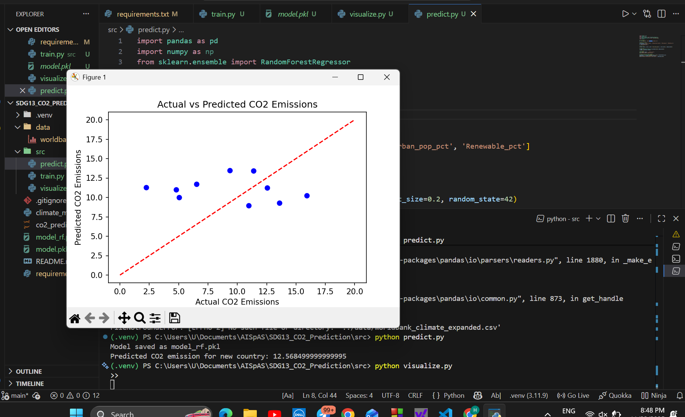

# SDG13 CO₂ Emissions Prediction using Machine Learning

## Introduction
This project addresses **UN Sustainable Development Goal 13: Climate Action** by predicting **CO₂ emissions per capita** for different countries based on socio-economic and energy-related features. The goal is to demonstrate how AI and ML can contribute to understanding and mitigating climate change.

## Dataset
The dataset is sourced from **World Bank data** and includes 50 countries with the following features:
- `GDP_per_capita` (USD)
- `Energy_use_per_capita` (kg of oil equivalent)
- `Urban_pop_pct` (% of population in urban areas)
- `Renewable_pct` (% energy from renewable sources)
- `CO2_per_capita` (target variable, metric tons per capita)

**CSV file:** `data/worldbank_climate.csv`

## Machine Learning Approach
- **Model:** Random Forest Regressor (also tested Linear Regression as baseline)
- **Features:** GDP, energy use, urban population, renewable energy %
- **Target:** CO₂ emissions per capita
- **Tools:** Python, Pandas, scikit-learn, Matplotlib

### Steps:
1. Data loading and preprocessing
2. Split into training and testing sets
3. Train ML models (Linear Regression & Random Forest)
4. Evaluate models (R², MAE, RMSE)
5. Visualize Actual vs Predicted CO₂ emissions
6. Make predictions for new countries

## Results
- Example prediction for a new country (GDP=20000, Energy=150, Urban=60%, Renewable=20%):  
  **Predicted CO₂ emission:** 12.57 metric tons per capita
- Visualizations saved in `results/visualization.png`
- Metrics saved in `results/metrics.txt`

## Ethical Considerations
- Dataset may contain biases based on reporting standards of countries.
- Predictions should not replace actual environmental policy planning.
- AI is used as a **supportive tool** for sustainability analysis.

## How to Run
1. Install dependencies: `pip install -r requirements.txt`
2. Train model: `python src/climate_model.py`
3. Make predictions: `python src/predict.py`
4. Visualize results: `python src/visualize.py`

## Screenshots

## Authors
- Hayu Yonatan
